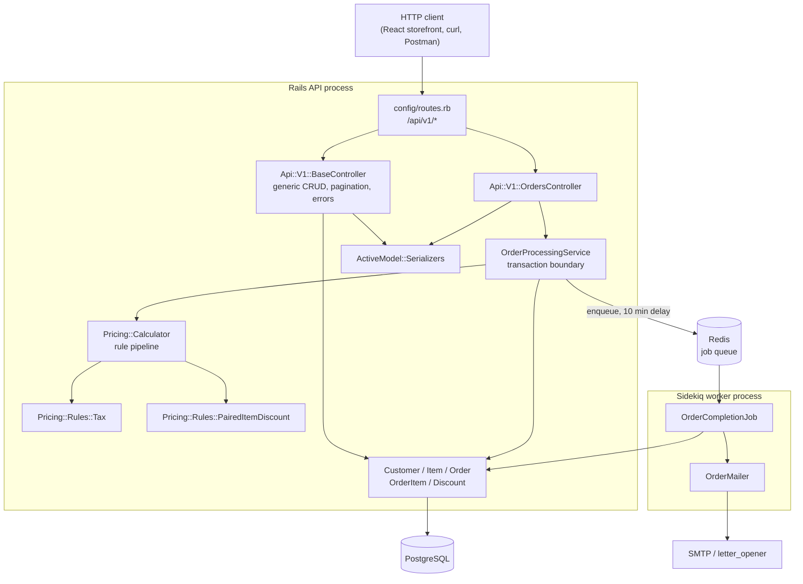
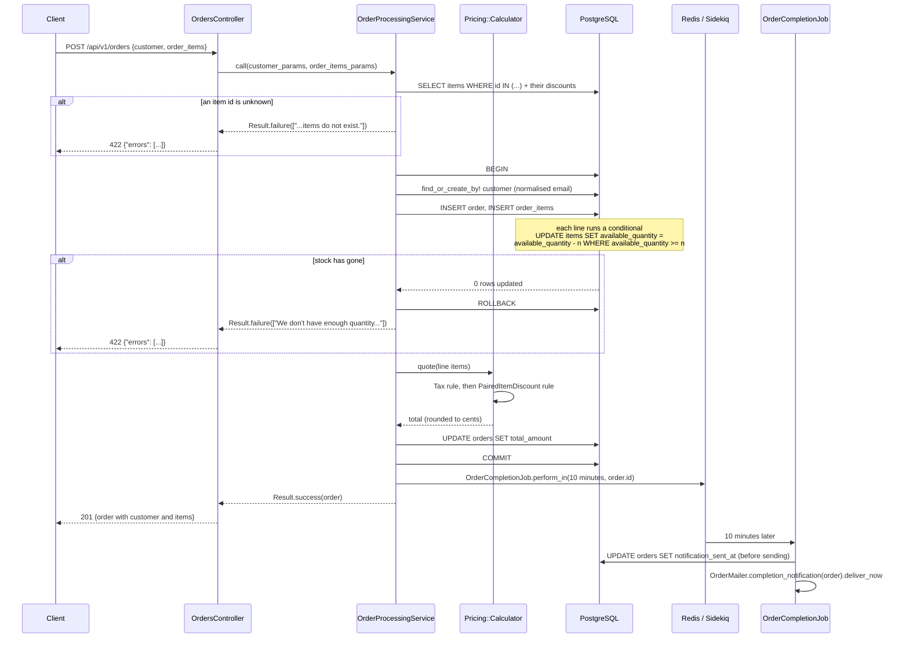

# A day at a coffee shop

A JSON API for the till of a coffee shop. It keeps a menu with per-item tax
rates and stock, records orders for new and returning customers, prices each
order (tax per item, plus "buy these two together" discounts), takes the stock,
and schedules a completion email through a background worker.

It is a Rails 6 API-only application backed by PostgreSQL, with Sidekiq and
Redis for the one piece of work that does not belong in the request. There is no
user interface here; the companion repository `agnos-coffee-shop-fe` is a React
storefront that consumes this API.

## Captured output

There is no UI in this repository, so instead of screenshots there are real
request/response transcripts, captured against the app running locally with
seeded data:

* **[docs/api-examples.md](docs/api-examples.md)** — the menu, the discounts, an
  order being placed (with the arithmetic shown so you can check the total), the
  stock coming off the shelf, a returning customer being matched, and every
  error path.
* **[docs/test-and-lint.md](docs/test-and-lint.md)** — the full `rspec` run, the
  `rubocop` run, and before/after query counts.
* **[docs/bug-reproductions.md](docs/bug-reproductions.md)** — literal output
  reproducing each bug that was fixed, run against the previous commit.

The shape of a successful order, abridged from `docs/api-examples.md`:

```console
$ curl -s -X POST /orders -H 'Content-Type: application/json' \
    -d '{"customer":{"name":"Ada Lovelace","email":"ada@example.com"},
         "order_items":[{"item_id":2,"quantity":1},{"item_id":4,"quantity":1}]}'
{
  "id": 1,
  "total_amount": 6.78,
  "customer": { "id": 1, "name": "Ada Lovelace", "email": "ada@example.com" },
  "items": [ { "id": 2, "name": "Flat White", ... },
             { "id": 4, "name": "Butter Croissant", ... } ]
}
HTTP 201
```

6.78 is 3.99 (Flat White, 3.80 plus 5% tax) plus 2.79 (Butter Croissant, 3.10
plus 12.5% tax, then 20% off because a Flat White is in the same basket).

## Architecture



Dependencies point inward. Controllers know about the service; the service knows
about the pricing rules and the models; the pricing rules know about neither the
service nor ActiveRecord persistence — they are handed plain
`Pricing::LineItem` values and return prices.

## Placing an order



## Quickstart

Requires Ruby 2.7.5, PostgreSQL and Redis.

```bash
gem install bundler -v 2.4.6
bundle install
cp .env.example .env          # edit if your database is not on localhost:5432
bundle exec rails db:setup    # create, load schema, seed the menu
bundle exec rails server      # http://localhost:3000
bundle exec sidekiq           # in a second terminal, for the completion emails
```

Then:

```bash
curl -s localhost:3000/api/v1/items
```

`Coffee shop.postman_collection.json` in the repository root imports straight
into Postman. `docs/api-examples.md` shows every endpoint with real output.

### With Docker

```bash
SECRET_KEY_BASE=$(openssl rand -hex 64) docker compose up --build
curl -s localhost:8530/api/v1/items
```

Compose brings up Postgres, Redis, the API (host port 8530) and a Sidekiq
worker. The web container runs `rails db:prepare` on start.

> The Dockerfile and compose file in this repository have been written and
> parse-checked with `docker compose config`, but **not** built or booted —
> the Docker daemon was unavailable in the environment this was prepared in.

## Configuration

Everything is read from the environment. `dotenv-rails` loads `.env` in
development and test; in production the environment supplies them directly.

| Variable | Required | Default | Purpose |
| --- | --- | --- | --- |
| `DATABASE_HOST` | no | `localhost` | PostgreSQL host. |
| `DATABASE_PORT` | no | `5432` | PostgreSQL port. |
| `DATABASE_USERNAME` | no | *(none — libpq falls back to the OS user)* | PostgreSQL role. |
| `DATABASE_PASSWORD` | no | *(none)* | Password for that role. |
| `DATABASE_NAME` | no | `coffee_shop_development` / `coffee_shop_production` | Database name for the current environment. |
| `TEST_DATABASE_NAME` | no | `coffee_shop_test` | Database used by the suite. |
| `DATABASE_URL` | no | *(unset)* | If set, Rails merges it over everything above. |
| `RAILS_MAX_THREADS` | no | `5` | Puma threads and ActiveRecord pool size. |
| `RAILS_MIN_THREADS` | no | `RAILS_MAX_THREADS` | Puma minimum threads. |
| `PORT` | no | `3000` | Port Puma binds. |
| `REDIS_URL` | no | `redis://localhost:6379/0` | Sidekiq queue. |
| `RAILS_ENV` | no | `development` | Rails environment. |
| `RAILS_LOG_LEVEL` | no | `info` | Production log level. `debug` logs every SQL statement, including customer emails. |
| `RAILS_LOG_TO_STDOUT` | no | *(unset)* | Log to stdout instead of `log/*.log`. Set in the container image. |
| `SECRET_KEY_BASE` | **yes in production** | *(none)* | Rails refuses to boot without it. |
| `EMAIL_DEFAULT_ADDRESS` | no | `no-reply@coffee-shop.example` | `From:` on the completion email. |
| `GMAIL_USERNAME` | production only | *(none)* | SMTP username. |
| `GMAIL_PASSWORD` | production only | *(none)* | SMTP password — use an app password, never an account password. |
| `HOST` | production only | *(none)* | Host used in mailer URLs. |

`config/master.key` is not in the repository (it is gitignored, as it should
be). `config/credentials.yml.enc` therefore cannot be decrypted; nothing in the
application reads from it, so this is only a note for anyone who adds a
credential later — use the environment.

## Development

```bash
bundle exec rspec                 # the whole suite
bundle exec rspec spec/services   # one directory
bundle exec rubocop               # lint
bundle exec rubocop -a            # lint, autocorrecting the safe offences
bundle exec rails db:seed         # re-seed the menu (idempotent)
```

The suite needs a PostgreSQL test database and nothing else — Sidekiq runs in
`Sidekiq::Testing.fake!` mode, so no Redis is required, and ActionMailer uses
the `:test` delivery method.

In development, mail is not sent: `letter_opener` writes it to
`tmp/letter_opener/` and opens it in a browser.

Current state:

```console
$ bundle exec rspec
129 examples, 0 failures

$ bundle exec rubocop
85 files inspected, no offenses detected
```

## Project structure

```
app/
  controllers/
    api/v1/
      base_controller.rb        Generic JSON CRUD: pagination, serialization, errors
      orders_controller.rb      The one non-generic action; delegates to the service
      discounts_controller.rb   Paired-discount management
      {customers,items,order_items}_controller.rb
    concerns/
      base_handler.rb           `actions` macro: a controller opts into what it exposes
      exception_handler.rb      Exceptions -> {"errors": [...]} with the right status
    health_controller.rb        GET /up, used by the container healthcheck
  models/
    customer.rb item.rb order.rb order_item.rb discount.rb
  services/
    order_processing_service.rb Transaction boundary for placing an order
    pricing/
      calculator.rb             Runs the rule pipeline, rounds to cents
      basket.rb                 What the rules are allowed to ask about the order
      line_item.rb quote.rb     Value objects
      rules/tax.rb              Per-item tax
      rules/paired_item_discount.rb  "Buy these two together"
  serializers/                  One per model; shapes the JSON
  sidekiq/order_completion_job.rb
  mailers/ views/order_mailer/  The completion email, HTML and text
config/
  constants.rb                  Page sizes, the notification delay, the email pattern
  database.yml                  Entirely environment-driven
  initializers/sidekiq.rb       REDIS_URL
db/migrate/                     Schema, plus the indexes and foreign keys migration
docs/                           Captured output referenced from this README
spec/
  models/ services/ requests/ mailers/ sidekiq/
  factories/ support/
```

## Design notes

**A rule pipeline for pricing.** Pricing was a pair of methods on the order
service with the tax formula and the discount formula inlined. It is now
`Pricing::Calculator`, which folds a list of rules over each line's unit price.
A rule is any object with `apply(unit_price, line_item, basket)`. That is the
seam a coffee shop actually grows through: happy hour, a loyalty tier, staff
discount, buy-one-get-one. Each is one small class added to the pipeline —
nothing existing changes, and the calculator takes its rules as a constructor
argument so a test (or a "what would this basket cost on Tuesday?" endpoint) can
price with a different set. The order of the rules is a business decision and is
stated in the class: tax is calculated on the shelf price, and the discount
comes off the taxed figure.

**One transaction, and the stock check in the database.** Placing an order
resolves the customer, writes the lines, takes stock and prices the basket
inside a single transaction, so a basket that fails on its third line leaves no
half-order and no stock missing. Stock is taken with a conditional
`UPDATE items SET available_quantity = available_quantity - n WHERE id = ? AND
available_quantity >= n`. The predicate is evaluated by the database under the
lock it takes for the write, so two concurrent orders for the last croissant
cannot both succeed; the previous read-modify-write in Ruby could oversell. The
model validation is still there, because it produces a friendly 422 for the
common case — but it is the UPDATE that is load-bearing.

**Business logic out of the controllers.** `OrdersController#create` now reads
as six lines: call the service, render the order or render the errors. Errors
have one shape everywhere (`{"errors": [...]}`), produced by `ExceptionHandler`
rather than by each action.

**Closed by default.** `BaseController`'s CRUD actions are private, and a
subclass promotes the ones it offers with `actions :index, :show, ...`. The
`actions` macro already existed but did nothing, because the actions it was
meant to expose were public already — which is how `PATCH /api/v1/orders/:id`
reached a generic update that could rewrite a placed order's `total_amount`.
Routes are now declared with explicit `only:` lists as well.

**Scalability: the bottleneck was N+1, not throughput.** A coffee shop does not
need a queue in front of its till; it needs the till not to issue fifty queries
to show twenty-five orders. Two were measured and fixed (numbers in
`docs/test-and-lint.md`):

* Pricing an order issued two SELECTs per line — one to resolve
  `order_item.item`, one for `item.discounts`. Items and their discounts are now
  loaded once up front and handed to the rules, which issue no queries at all. A
  seven-line order went from 35 SQL statements to 23, with item and discount
  lookups going from 7 + 7 to 1 + 1, and they no longer grow with basket size.
* `index` was an unbounded `Model.all` feeding a serializer that renders each
  order's customer and items. 27 orders cost 55 queries. Collections are now
  paginated (default 25, hard cap 100, `meta` in the response) and preloaded:
  25 orders, 4 queries.

Underneath both, the join columns had no indexes and no foreign keys despite
being `null: false`, so every association lookup was a sequential scan and an
item could be deleted out from under the orders referencing it. The migration
`20230212090000_add_foreign_keys_and_indexes` fixes that.

**Money is stored as `float`.** It should be integer cents, or `decimal`. It is
not being changed here: the paired frontend calls `total_amount.toFixed(2)` on
the value, and Rails serializes `BigDecimal` as a JSON *string*, so switching the
column would silently break the storefront. Instead every line and total is
rounded to two decimal places inside `Pricing::Calculator`, so the total always
equals the sum of the lines the customer can see, and float drift never reaches
the bill. Converting to cents is the right next change, and it is a coordinated
one across both repositories.

## Limitations

* **No authentication or authorisation.** Every endpoint is open, CORS is
  `origins '*'`, and anyone who can reach the API can delete the menu. This is
  the largest gap for any real deployment and was outside the original brief.
* **Discounts are directional and single-application.** A discount row says "take
  n% off item A when item B is also in the basket". Discounting both sides needs
  two rows, and at most one discount applies per line (the first that matches) so
  that the total stays deterministic.
* **Discounts do not know about quantity.** Two croissants and one flat white
  discounts both croissants. A genuine "buy one get one" needs a rule that can
  see the whole line rather than just the unit price — the pipeline supports it,
  but no such rule ships.
* **No `PATCH` for orders or order items.** A placed order is a priced snapshot,
  and changing a line's quantity after the fact would have to reconcile stock.
  Cancelling is `DELETE`, which does not return the stock to the shelf.
* **Money is `float`** — see the design notes above.
* **`total_amount` is a snapshot.** Changing an item's price or tax rate does not
  re-price past orders. That is deliberate.
* **The completion email is fire-and-forget.** It goes out ten minutes after the
  order is placed regardless of whether the order was actually handed over;
  there is no "ready" signal from a barista.
* **No rate limiting, no request tracing, no metrics.**
* **Docker is unbuilt.** The image and compose file are written to a reasonable
  standard but have not been built or run — see the note under Quickstart.

## If I had more time

The first three things, in order: authentication (the API is wide open), moving
money to integer cents in step with the frontend, and a quantity-aware discount
rule so the pipeline can express buy-one-get-one.
