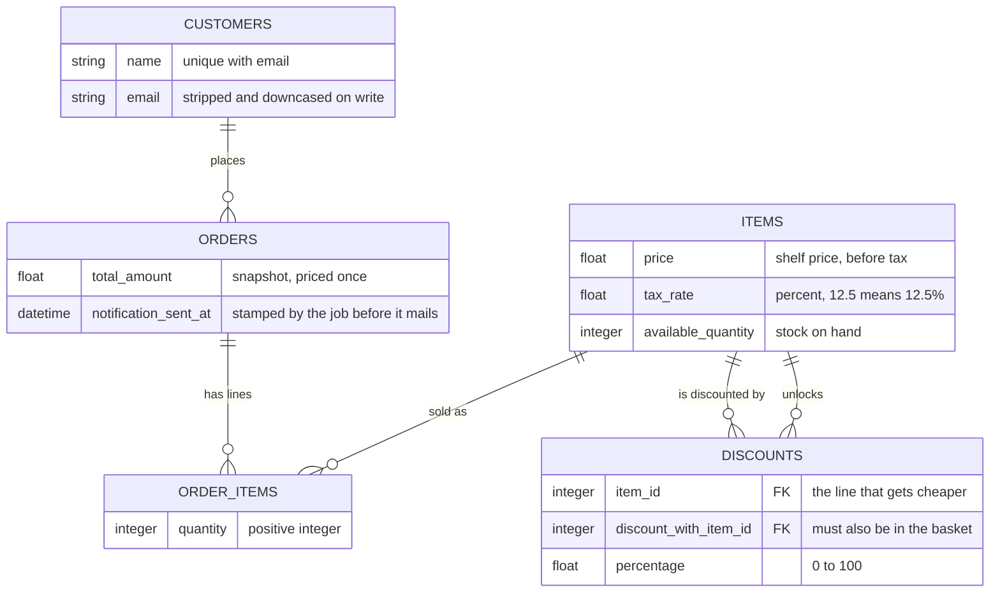
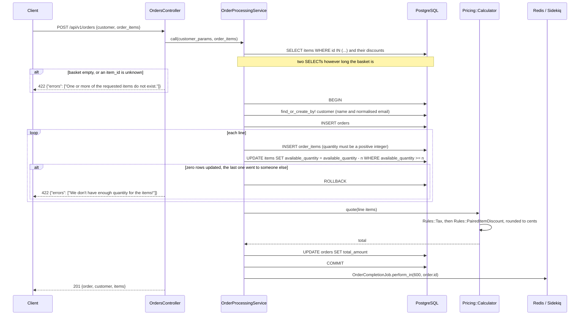

# A day at a coffee shop

A JSON API for the till of a coffee shop: a menu with per-item tax rates and stock, orders for new
and returning customers, "buy these two together" discounts, and a completion email ten minutes
after the order.

The CRUD is the boring half; the interesting half is what an order *costs*. Rails 6.0, API-only,
PostgreSQL, Sidekiq and Redis for the one job that does not belong in a request. No UI here — the
companion `agnos-coffee-shop-fe` is a React storefront that consumes this API.

## What one order costs

A Flat White and a Butter Croissant, from the menu in `db/seeds.rb`:

| Line | Shelf | Tax rate | Taxed | Paired discount | Charged |
| --- | --- | --- | --- | --- | --- |
| Flat White | 3.80 | 5% | 3.99 | — | **3.99** |
| Butter Croissant | 3.10 | 12.5% | 3.4875 | 20% off — a Flat White is in the basket | **2.79** |
| | | | | | **6.78** |

`Pricing::Calculator` folds an ordered list of rules over each line's unit price. Two ship:
`Rules::Tax`, applying the item's own `tax_rate` because a coffee and a takeaway sandwich are
rarely taxed alike, and `Rules::PairedItemDiscount`, which reads the item's already-loaded
`discounts` and asks the basket whether the paired item is present, issuing no queries of its own.
Their order is a business decision written into the class — tax on the shelf price, discount off
the taxed figure — and `spec/services/pricing/calculator_spec.rb` pins it as *"applies the
discount to the taxed price, not the shelf price"*. Each line is rounded to whole cents before the
total is summed, so the bill equals the lines the customer sees.

The discount rule is **directional** ("n% off A when B is also in the basket", so both sides needs
two rows), applies **at most one discount per line** (first match wins, keeping the total
deterministic), and is **quantity-blind** (two croissants and one flat white discounts both
croissants). The last is cheap to fix: a rule is any object answering `apply(unit_price, line_item,
basket)` and the calculator takes its rules as a constructor argument, so buy-one-get-one is one
class and no change to anything existing — a spec proves it by pricing a basket with a rule the
application does not ship.

## The data the till keeps



**`discounts` points at `items` twice** — `item_id` is the line that gets cheaper,
`discount_with_item_id` the item that unlocks it, so `Item` has both `has_many :discounts` and
`has_many :unlocked_discounts` and deleting an item cannot orphan a discount. A discount may not
pair an item with itself. **A customer is the `(name, email)` pair,** uniquely indexed, with the
email normalised on write *and* at the lookup in `OrderProcessingService`, so `"Ada@Example.COM "`
is the same regular rather than a second row. `notification_sent_at` is the job's idempotency
flag, stamped before delivery so a retry cannot mail twice. Every join column is `null: false`,
indexed and foreign-keyed; money is `float`, see [Known gaps](#known-gaps).

## Placing an order



**Unknown items fail before anything is written,** because the items and their discounts are
loaded up front: a stale item list in the storefront gets a 422 with a sentence, not a 500.
`spec/requests/api/v1/orders_spec.rb` holds that as *"rejects an unknown item with 422 rather than
500"*, and `spec/models/order_item_spec.rb` the model half, where an absent item fails validation
instead of raising `NoMethodError`.

**Stock is taken by the database, not by Ruby.** The conditional `UPDATE` above has its predicate
evaluated under the row lock the write takes, so two concurrent orders for the last croissant cannot
both succeed, and zero rows updated rolls the order back. The model validation stays because it
gives the friendly 422 for the ordinary case, but the `WHERE` clause is load-bearing. A quantity of
`0` or `-3` never gets that far: `quantity` is validated `only_integer, greater_than: 0`, pinned by
*"rejects a zero quantity"* and *"rejects a negative quantity"*.

**Pricing happens after the lines exist, in the same transaction,** so a basket that fails on its
third line leaves no half-order and no missing stock.

## The endpoints

All under `/api/v1`. Collections are paginated — `page`, `per_page`, default 25, hard cap 100 —
and answer with the plural model name plus a `meta` block: `{"orders": [...], "meta": {"page": 1,
"per_page": 25, "total_count": 31, "total_pages": 2}}`. Errors have one shape everywhere,
`{"errors": ["..."]}`, from `ExceptionHandler` rather than from each action: 404 missing, 422
invalid, 400 missing parameter. `Coffee shop.postman_collection.json` imports into Postman.

| Resource | Verbs | Notes |
| --- | --- | --- |
| `items`, `customers`, `discounts` | index, show, create, update, destroy | the menu, the regulars, the paired-offer rows |
| `orders` | index, show, create, destroy | **no update** — a placed order is a priced snapshot |
| `order_items` | index, show, create, destroy | creating one takes stock, as an order line does |
| `GET /up` | — | 200 only if the database answers; the healthcheck target |

With no UI to screenshot, the evidence is captured traffic.
**[docs/api-examples.md](docs/api-examples.md)** holds real `curl` pairs: the paginated menu, the
discounts, an order placed with its arithmetic spelled out, stock coming off the shelf, a returning
customer matched on a differently-cased email, and eight error paths with exact bodies.
**[docs/test-and-lint.md](docs/test-and-lint.md)** has the `rspec` and `rubocop` runs, and
**[docs/bug-reproductions.md](docs/bug-reproductions.md)** reproduces the bugs that were fixed.

## Running it

Ruby 2.7.5 (`.ruby-version`), PostgreSQL and Redis. Every setting comes from the environment and
`.env.example` documents all of them: `SECRET_KEY_BASE` is required in production, `DATABASE_URL`
overrides the individual database variables, and `RAILS_LOG_LEVEL` defaults to `info` because
`debug` logs every SQL statement, customer emails included.

```bash
gem install bundler -v 2.4.6
bundle install
cp .env.example .env          # edit if your database is not on localhost:5432
bundle exec rails db:setup    # create, load schema, seed the menu
bundle exec rails server      # http://localhost:3000
bundle exec sidekiq           # second terminal, for the completion emails
curl -s localhost:3000/api/v1/items
```

Development mail is not sent — `letter_opener` writes it to `tmp/letter_opener/`. The storefront
defaults to `http://localhost:3001/api/v1` and honours `REACT_APP_API_BASE_URL`, so point that at
whichever port you publish. Compose brings up Postgres, Redis, the API on host port 8530 and a
Sidekiq worker; the web container runs `rails db:prepare` on start, and neither Postgres nor Redis
is published to the host.

```bash
SECRET_KEY_BASE=$(openssl rand -hex 64) docker compose up --build
curl -s localhost:8530/api/v1/items
```

> **Container status, quoted from this repository's own uplift report**
> (`logs/uplift_batch2_2026-09-24/agnos-coffee-shop-be.md`):
> Build verified: **NOT RUN — deferred, Docker off**.
> Boot verified: **NOT RUN — deferred, Docker off**.
> `docker compose config -q` → exit 0 (parse-checked only, nothing started).
> The `pg` native build and `bootsnap precompile` are therefore unverified.

## What the suite holds in place

```console
$ bundle exec rspec
129 examples, 0 failures

$ bundle exec rubocop
85 files inspected, no offenses detected
```

Both run against this tree under Ruby 2.7.5 and a local PostgreSQL 17; the suite needs a test
database and nothing else, since Sidekiq runs in `Sidekiq::Testing.fake!` and ActionMailer uses
`:test`. Six comments are labelled `Regression:` and name the bug they pin — the unguarded
`item.available_quantity`, the quantity with only a presence check, the stock callback that escaped
as a 500, the discounts endpoint routed with no controller, and two in the mailer.

Query counts, re-measured on this tree with an
`ActiveSupport::Notifications.subscribe('sql.active_record')` counter, ignoring `SCHEMA`
statements and transaction control:

| Operation | Statements | Made up of |
| --- | --- | --- |
| Place an order, 7 distinct lines, new customer | **21** | 2 preloads, 3 for the customer, 1 order INSERT, 2 per line (INSERT plus conditional UPDATE), 1 total UPDATE |
| `GET /api/v1/orders`, a page of 25 out of 31 | **5** | `COUNT(*)` for `meta`, the page, then customers, order_items and items preloaded |

Neither grows with basket size or page contents, and two specs keep it that way: *"does not grow the
item/discount queries with basket size"* asserts exactly one `discounts` SELECT for a five-line
basket, *"loads customers and items without an N+1"* caps the index. `docs/test-and-lint.md` also
carries before/after figures, but its "before" side was measured against a commit no longer in this
repository's history — the numbers above are the checkable ones.

One dependency note, because it is a trap: `json` is pinned **`~> 2.3`** in the `Gemfile`, and
`Gemfile.lock` carries that constraint, resolved at 2.21.2. Rails 6.0's ActiveSupport JSON encoder
passes `quirks_mode:` to `JSON.generate` and json 3.x removed that keyword, so an unpinned
resolution makes *every* `render json:` raise `ArgumentError: unknown keyword: quirks_mode`. Nothing
pulled `json` into the lockfile until RuboCop (`json >= 2.3`) was added; do not relax the pin
without moving off Rails 6.0.

## Known gaps

* **No authentication or authorisation at all**, and CORS is `origins '*'` — anyone who can reach
  the API can delete the menu. Outside the original brief; the largest gap for a real deployment.
* **Money is `float`.** It should be integer cents, but the storefront reads `total_amount` as a
  number and calls `.toFixed(2)` while Rails serialises `BigDecimal` as a JSON *string*, so changing
  the column alone breaks it. Mitigated by rounding to cents in `Pricing::Calculator`.
* **`total_amount` never re-prices** and there is **no `PATCH` for orders or order items** —
  changing a line's quantity would have to reconcile stock. Both deliberate. Cancelling is
  `DELETE`, and it does *not* put the stock back on the shelf.
* **The completion email is fire-and-forget**, sent ten minutes after the order whether or not
  anything was handed over; there is no "ready" signal. No rate limiting, tracing or metrics.
* **No `available_quantity >= 0` check constraint.** Rails 6.0's Ruby schema format cannot
  round-trip check constraints, so one would survive `db:migrate` and vanish on `db:schema:load` —
  worse than not having it. The reasoning is in the migration.

## The next three changes

Authentication first, by a distance; then money to integer cents in step with the storefront; then
a quantity-aware discount rule, so the pipeline can express buy-one-get-one.
